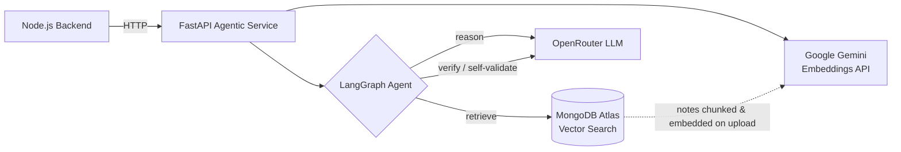
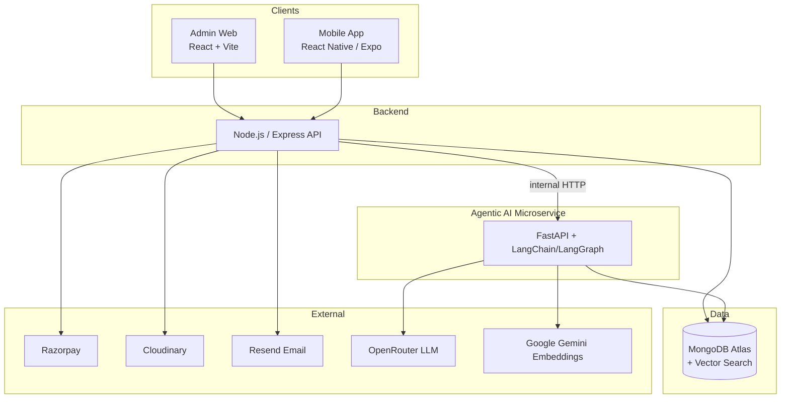
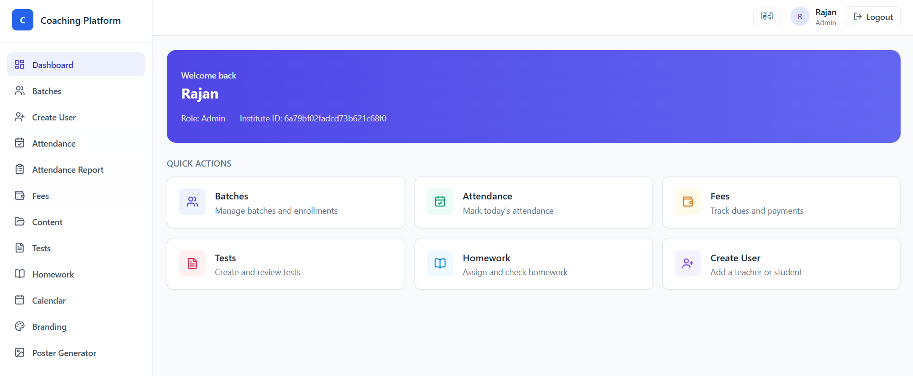
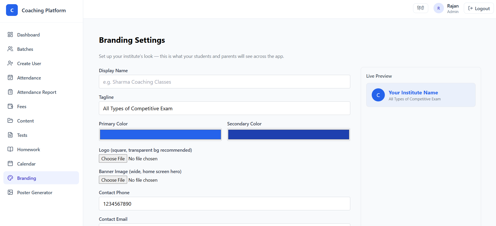
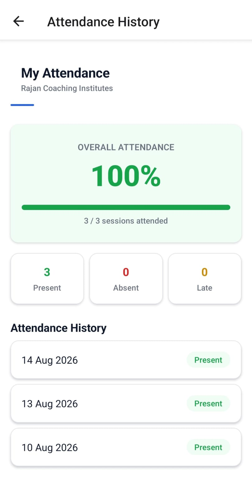
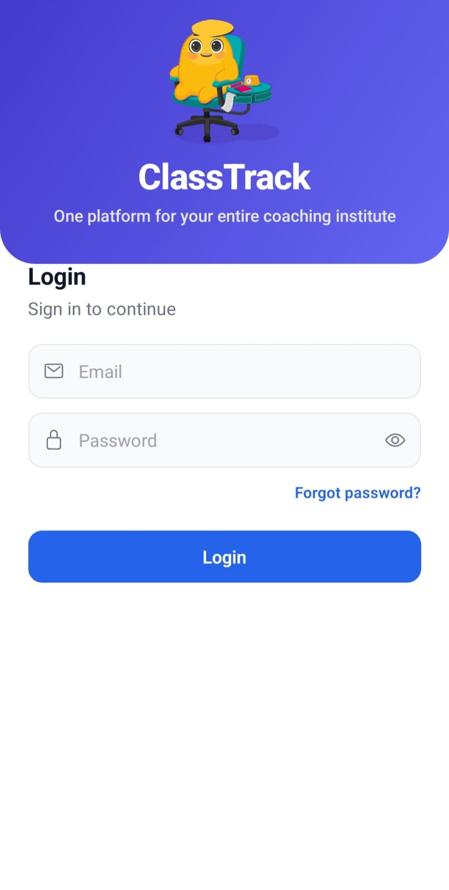
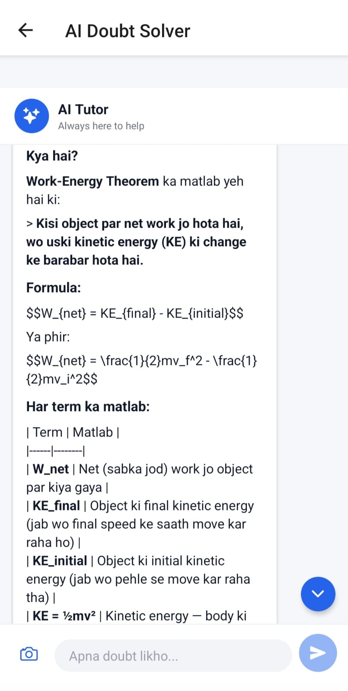
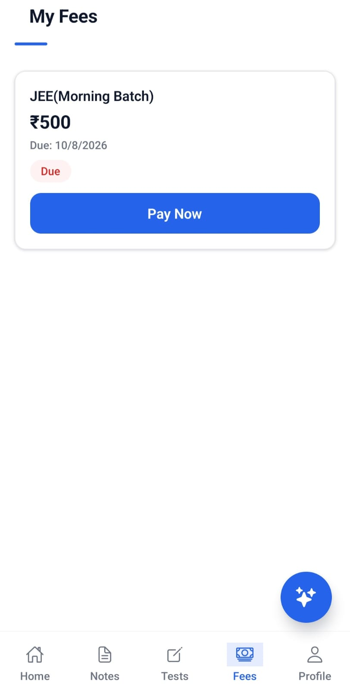

<div align="center">

# 🎓 Sankalp — Coaching Institute Management SaaS

**A production-grade, multi-tenant SaaS platform for coaching institutes — with a real agentic AI layer, not just an OpenAI wrapper.**

[](https://nodejs.org/)
[](https://react.dev/)
[](https://expo.dev/)
[](https://fastapi.tiangolo.com/)
[](https://www.langchain.com/)
[](https://www.mongodb.com/atlas)
[](https://render.com/)
[](./LICENSE)

[Live API](https://coaching-backend-l17m.onrender.com) · [Agentic AI Service](https://sankalp-agentic-service.onrender.com/health) · [Report Bug](../../issues) · [Request Feature](../../issues)

</div>

---

## 📖 Overview

**Sankalp** is a full-stack, multi-tenant SaaS platform that digitizes the entire lifecycle of running a coaching/tuition institute — admissions, batches, attendance, fees, tests, content, and communication — for **Super Admins, Admins, Teachers, Students, and Parents**, all under one roof with strict per-institute data isolation.

What sets this project apart is its **dedicated Agentic AI microservice** — a separate Python (FastAPI + LangChain/LangGraph) service that powers a **RAG-grounded AI Doubt Tutor, self-validating question generation, weak-topic study plans, and parent progress reports** — built and deployed as a real, independently-scalable service, not a single API call bolted onto the backend.

---

## 📑 Table of Contents

- [Key Features](#-key-features)
- [🤖 Agentic AI Architecture](#-agentic-ai-architecture-the-highlight)
- [System Architecture](#-system-architecture)
- [Screenshots](#-screenshots)
- [Tech Stack](#-tech-stack)
- [Project Structure](#-project-structure)
- [Getting Started](#-getting-started)
- [Environment Variables](#-environment-variables)
- [User Roles](#-user-roles)
- [Roadmap](#-roadmap)
- [Contributing](#-contributing)
- [License](#-license)
- [Author](#-author)

---

## ✨ Key Features

### Core Platform
- 🏢 **Multi-tenant institute management** — isolated data per institute, trial/active/suspended subscription lifecycle, custom branding, auto-generated marketing posters
- 🔐 **JWT auth + 5-role RBAC** (Super Admin, Admin, Teacher, Student, Parent) with access+refresh tokens, ownership-level authorization guards
- 👥 **User & batch management** — bulk operations, teacher/student assignment
- 📅 **Attendance system** with batch/student-level analytics
- 💳 **Fee management** — Razorpay integration with webhook signature verification, auto-generated PDF receipts, defaulter tracking, automated reminders
- 💰 **Salary management** for institute staff
- 📝 **Tests, results & leaderboard** — bulk question upload, auto-evaluation, batch-wise ranking, weak-topic analysis
- 📚 **Digital content library** — Cloudinary-backed notes & lecture management
- 🎮 **Gamification** — badges, achievements, daily activity streaks
- 📈 **Leads/Admissions CRM** — pipeline from inquiry to enrollment
- 🔔 **Real-time notifications** via Socket.IO + transactional email (Resend)
- 📊 **Analytics dashboard**, audit logging, i18n (multi-language)

### 🤖 Agentic AI Layer (built as a standalone microservice)
- 💬 **RAG-grounded AI Doubt Tutor** — a LangGraph multi-step agent (`retrieve → reason → verify`, with self-correcting retry) that answers student doubts using the institute's own uploaded notes, not just generic LLM knowledge
- 📄 **Notes → Vector Search pipeline** — PDF notes are chunked, embedded (Google Gemini embeddings), and indexed in MongoDB Atlas Vector Search, scoped per institute
- ❓ **Self-validating Question Generator** — generates MCQs grounded in the institute's own notes, then a second LLM pass validates the questions for duplicate options, ambiguity, and correctness before returning them for teacher review
- 📊 **AI Study Plan generator** — turns a student's weak-topic test analytics into a personalized, encouraging study plan
- 👨‍👩‍👧 **AI Parent Report generator** — converts attendance, fees, and performance data into a simple, jargon-free Hinglish summary for parents
- 🖼️ **Multimodal support** — students can photograph a handwritten/textbook doubt; the vision-capable LLM reads and solves it
- ✅ **LLM-as-judge evaluation harness** — a lightweight, custom evaluation script (no heavy RAGAS dependency) that scores faithfulness & relevance of the RAG tutor's answers
- 🛡️ **Production-hardened**: structured logging, per-endpoint rate limiting, graceful fallback on AI service errors — deployed independently on Render

---

## 🤖 Agentic AI Architecture (the highlight)

The AI layer is **not** a single OpenRouter call wired into the main backend. It's a dedicated **FastAPI microservice**, built incrementally through 8 phases, that the Node backend talks to over internal HTTP — the same way it talks to Razorpay or Cloudinary.



| Capability | How it's built |
|---|---|
| **RAG Doubt Tutor** | LangGraph state machine: `retrieve` (vector search over institute notes) → `reason` (grounded answer generation) → `verify` (LLM self-checks its own answer against guardrails, retries once if it fails) |
| **Vector store** | MongoDB Atlas Vector Search — reuses the existing Atlas cluster (no extra infra), filtered per `instituteId` for tenant isolation |
| **Embeddings** | Google Gemini (`gemini-embedding-001`), 768-dim, free tier |
| **Question Generation** | Same retrieve → generate → validate pattern — questions are grounded in real notes content and self-checked for quality before reaching the teacher |
| **Evaluation** | Custom LLM-as-judge script scoring faithfulness & relevance — a lightweight alternative to RAGAS, chosen to stay within free-tier/low-RAM constraints |
| **Resilience** | Structured logging (request timing on every call), `slowapi` rate limiting per endpoint, background-task PDF ingestion so uploads never block on embedding |
| **Deployment** | Independent Render free-tier web service, communicating with the Node backend via a configurable internal URL |

---

## 🏗️ System Architecture



---

## 📸 Screenshots


| Admin Dashboard | Student — AI Doubt Tutor |
|---|---|
|  |  |

| Attendance & Fees | Mobile App |
|---|---|
|  |  |  |   |

---

## 🛠️ Tech Stack

**Backend (Node.js)**
- Node.js, Express 5, MongoDB + Mongoose 9
- JWT + bcrypt (auth), Zod (validation)
- Razorpay (payments), Cloudinary (media), Resend (email)
- Socket.IO (real-time), PDFKit (receipts)
- Multer / csv-parser / xlsx (uploads), Winston + Morgan (logging)

**🤖 Agentic AI Service (Python)**
- FastAPI, Uvicorn
- LangChain + LangGraph (multi-step reasoning agents)
- OpenRouter (LLM inference), Google Gemini (embeddings)
- MongoDB Atlas Vector Search (`pymongo`, `$vectorSearch`)
- `pypdf` + `langchain-text-splitters` (notes ingestion pipeline)
- `slowapi` (rate limiting), Python `logging` (structured logs)
- Custom LLM-as-judge evaluation harness

**Admin Web**
- React 19, Vite 8, Tailwind CSS 3, React Router 7, Axios, i18next

**Mobile App**
- React Native 0.81 + Expo 54 (Expo Router), TypeScript
- Axios, Socket.IO client, Expo modules (Image/Document Picker, Notifications, Secure Store)

**Infrastructure**
- MongoDB Atlas (database + vector search)
- Render (backend + agentic-service hosting, free tier)
- GitHub (version control)

**Architecture Pattern**
- Node backend: strict modular layering — `routes → controller → service → repository → model`
- Python service: `api → graph/chain → services → core` — chains for simple flows, LangGraph state machines for multi-step reasoning

---

## 📁 Project Structure
coaching_management_system/
├── backend/ # Node.js REST API
│ └── src/
│ ├── modules/ # auth, users, batches, attendance, fees, tests,
│ │ # notes, doubt, parentReport, ...
│ ├── config/ # env, db, agenticService.config.js
│ └── middlewares/
├── agentic-service/ # Python FastAPI + LangChain/LangGraph AI microservice
│ └── app/
│ ├── api/ # doubt, notes, question_gen, study_plan, parent_report
│ ├── graph/ # LangGraph state machines (doubt, question generation)
│ ├── chains/ # simpler single-pass LangChain chains
│ ├── services/ # embeddings, retrieval, notes ingestion
│ └── core/ # config, mongo, logging, rate limiting
│ └── eval/ # LLM-as-judge evaluation script
├── admin-web/ # React + Vite admin dashboard
└── mobile-app/ # React Native (Expo) app — all 5 roles

---

## 🚀 Getting Started

### Prerequisites
- Node.js (LTS), Python 3.11+, MongoDB Atlas account (free M0 tier works, with Vector Search enabled), npm, pip

### 1. Backend
```bash
cd backend
npm install
cp .env.example .env   # MONGO_URI, JWT secrets, Razorpay, Cloudinary, Resend, AGENTIC_SERVICE_URL
npm run dev
npm run seed:super-admin
```

### 2. Agentic AI Service
```bash
cd agentic-service
python -m venv venv
venv\Scripts\activate        # Windows
pip install -r requirements.txt
cp .env.example .env         # OPENROUTER_API_KEY, GOOGLE_API_KEY, MONGO_URI, NODE_BACKEND_URL
uvicorn app.main:app --reload --port 8001
```

### 3. Admin Web
```bash
cd admin-web
npm install
cp .env.example .env   # VITE_API_BASE_URL
npm run dev
```

### 4. Mobile App
```bash
cd mobile-app
npm install
cp .env.example .env   # EXPO_PUBLIC_API_BASE_URL
npx expo start
```

---

## 🔑 Environment Variables

**Backend**

| Variable | Description |
|---|---|
| `MONGO_URI` | MongoDB connection string |
| `JWT_ACCESS_SECRET` / `JWT_REFRESH_SECRET` | JWT signing secrets |
| `CLIENT_URL` | Allowed frontend origin (CORS) |
| Razorpay / Cloudinary / Resend keys | Third-party service credentials |
| `AGENTIC_SERVICE_URL` | Base URL of the deployed FastAPI agentic service |

**Agentic Service**

| Variable | Description |
|---|---|
| `OPENROUTER_API_KEY` | LLM inference (chat completions, vision) |
| `GOOGLE_API_KEY` | Gemini embeddings API |
| `MONGO_URI` / `MONGO_DB_NAME` | Same Atlas cluster as the backend |
| `NODE_BACKEND_URL` | Backend base URL |

> See `.env.example` in each folder for the complete list.

---

## 👥 User Roles

| Role | Key Capabilities |
|---|---|
| **Super Admin** | Onboard institutes, platform-wide oversight |
| **Admin** | Full institute management — users, batches, fees, salaries, content, analytics |
| **Teacher** | Batches, attendance, homework, tests, AI-assisted question generation |
| **Student** | Attendance, tests, homework, notes/lectures, AI Doubt Tutor, gamification |
| **Parent** | Attendance, fees, results, and AI-generated progress reports for their child |

---

## 🗺️ Roadmap

- [ ] Extend RAG ingestion to scanned/handwritten notes (OCR) and lecture transcripts
- [ ] Connect AI-generated questions directly into the test-creation flow
- [ ] Guardrail-aware LLM-judge scoring (distinguish "correct decline" from "failed to answer")
- [ ] CI/CD pipeline + automated tests
- [ ] Admin-web and mobile-app production deployment

---

## 🤝 Contributing

Contributions, issues, and feature requests are welcome — feel free to fork the repo and submit a pull request.

---

## 📄 License

This project is licensed under the **MIT License** — see [LICENSE](./LICENSE) for details.

---

## 👤 Author

**Rajan Kumar Singh**
Computer Science Student · Full-Stack & Agentic AI Developer

- GitHub: [@rajankumarsingh01](https://github.com/rajankumarsingh01)

</div>